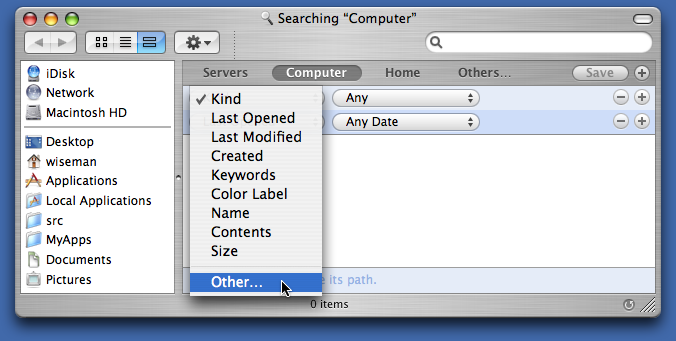
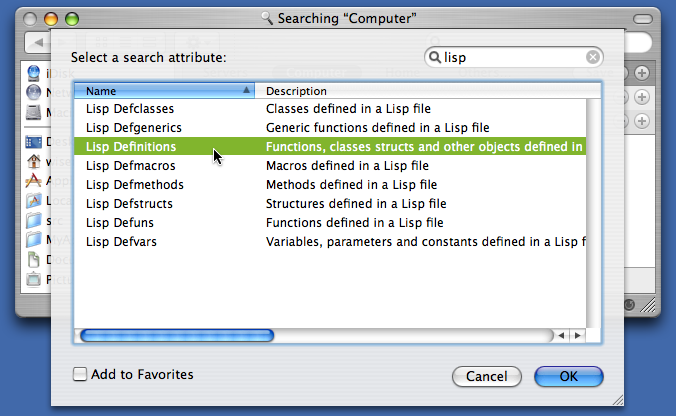
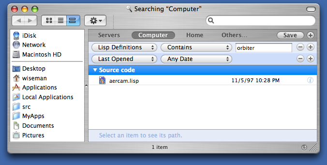

# Lisp Metadata Indexer, a Spotlight Plugin

John Wiseman
jjwiseman@gmail.com


## What does it do?

This importer plugin indexes files with `.lisp`, `.lsp` and `.cl`
extensions using the Spotlight search engine that was introduced by
Apple in OS X 10.4.

You might notice that even before you install this plugin that some of
your Lisp files have already been indexed by Spotlight. It is possible
that something on your system set the type of some files as “TEXT”, in
which case the default Spotlight text indexer will process the
files. This only happens on a file-by-file basis, though, whereas the
Lisp Metadata Importer instructs the system to index all files with
the extensions listed above, regardless of whether or not the system
already thinks they’re text files. The Lisp importer also does some
Lisp-specific indexing that you might find more useful than the
default text indexing.


## How do I install it?

Copy the Lisp Metadata Importer.mdimporter file into the
`/Library/Spotlight` folder.

## How do I uninstall it?

Remove the Lisp Metadata Importer.mdimporter file from the
`/Library/Spotlight` folder.

## How do I test it once it is installed?

Try indexing a single Lisp file using the `mdimport` command. When you
run `mdimport` with the `-d1` flag it will tell you which plugin it’s
using, if any, to index the file. You should see a reference to the
`Lisp Metadata Importer.mdimporter` file.

```
lem:~ $ mdimport -d1 variables.lisp
2005-09-15 12:05:55.493 mdimport[6962] Import '/Users/wiseman/variables.lisp' type
'com.lemonodor.lisp-source' using
'file://localhost/Library/Spotlight/Lisp%20Metadata%20Importer.mdimporter/'
```

Once you’ve run `mdimport`, use the `mdls` command to look at the
metadata associated with the file. The important things to look for
are that the `kMDItemContentType` is `com.lemonodor.lisp-source`, and
that there are some attributes with names that begin with `org_lisp`,
like `org_lisp_defmacros` or `org_lisp_defuns`.

```
lem:~ $ mdls variables.lisp
variables.lisp -------------
kMDItemAttributeChangeDate     = 2005-09-08 11:30:18 -0700
kMDItemContentCreationDate     = 2005-09-02 17:41:07 -0700
kMDItemContentModificationDate = 2005-09-02 17:41:08 -0700
kMDItemContentType             = "com.lemonodor.lisp-source"
kMDItemContentTypeTree         = (
    "com.lemonodor.lisp-source",
    "public.source-code",
    "public.plain-text",
    "public.text",
    "public.data",
    "public.item",
    "public.content"
)
kMDItemDisplayName             = "variables.lisp"

# and on and on, until finally…

org_lisp_defclasses            = ("i-dont-think-so")
org_lisp_defgenerics           = (attack, "(setf mood)", "(setf mood)")
org_lisp_definitions           = (
    foo,
    "(setf foo)",
    "oh-noe",
    "*oh-no*",
    "*hee-ho*",
    "+thing+",
    "i-dont-think-so",
    "BRAIN-CELL",
    "(RAT-BRAIN-CELL",
    attack,
    attack,
    "(setf mood)",
    "(setf mood)"
)
org_lisp_defmacros             = ("oh-noe")
org_lisp_defmethods            = (attack, "(setf mood)")
org_lisp_defstructs            = ("BRAIN-CELL", "RAT-BRAIN-CELL")
org_lisp_defuns                = (foo, "(setf foo)")
org_lisp_defvars               = ("*oh-no*", "*hee-ho*", "+thing+")
```

If you see those attributes then the importer is working correctly.

If the importer doesn’t seem to be working and you’ve double checked
to make sure you copied it to the correct folder, try the `mdimport
-r` trick in the next question & answer; it’s the equivalent of
kicking a malfunctioning jukebox.


## How do I index all my Lisp files?

Use `mdimport again`, this time with the `-r` flag, and passing it the
path to the Lisp plugin.

```
lem:~ $ mdimport -r /Library/Spotlight/Lisp\ Metadata\ Importer.mdimporter/
2005-09-15 12:41:38.650 mdimport[7169] Asking server to reimport files with UTIs: (
    "dyn.ah62d4rv4ge8024pxsa",
    "com.lemonodor.lisp-source",
    "dyn.ah62d4rv4gq81k3p2su11uppqrf31appxr741e25f",
    "dyn.ah62d4rv4ge80265u",
    "dyn.ah62d4rv4ge80g5a"
)
```

## What exactly is being indexed?

The Lisp metadata importer indexes the definitions contained in a
file. This includes functions, macros, classes, methods, generic
functions, structures, defvars, defparameters and defconstants. It
also includes any object FOO defined by a form that looks like
`(defsomething FOO ...)`. In addition to definitions, the entire
contents of the file are indexed for full text queries.

## How do I search for something?

The GUI way is to hit Command-F in the finder to bring up a Find
window. Click on one one of the attributes and select “Other...” to
see a list of other attributes:



Choose one of the Lisp importer’s attributes from the list that comes
up (you can type “lisp” into the search field on the upper right to
filter out the non-Lisp attributes):



Now enter the text you’d like to search for and watch the matching
files appear:



Some people have reported that the Lisp-specific attributes weren’t
available in the Find dialog until they re-launched the Finder (to
re-launch the finder, hit Command-Option-Esc and then select the
Finder in the “Force Quit Applications” dialog that pops up).

The non-GUI way to do Spotlight searches is to use the `mdfind`
command. I did this the other day when someone on IRC asked how to do
search-and-replace on a string. I knew I had written a function to do
that, but I couldn’t remember which project the code was in.

```
heavymeta:~ $ mdfind "org_lisp_defuns == '*search*replace*'"
/Users/wiseman/inet-projects/echo/server/xml-rpc.lisp
/Users/wiseman/inet-projects/il/utilities/xml-rpc/pregexp-utils.lisp
/Users/wiseman/John/src/www-link-validator/link-validator.lisp
```

(It turned out I had a couple implementations lying around.)

The Spotlight query language used by mdfind is [documented online by
Apple](https://developer.apple.com/library/mac/documentation/carbon/conceptual/spotlightquery/concepts/queryformat.html).

## What are the attributes I can search on and where do they come from in the Lisp file?

The following metadata attributes are defined by the Lisp Metadata
Importer:

| Metadata attribute   | Defining forms                         |
|----------------------|----------------------------------------|
| org_lisp_defuns      | defun                                  |
| org_lisp_defmacros   | defmacro                               |
| org_lisp_defclasses  | defclass                               |
| org_lisp_defgenerics | defgeneric                             |
| org_lisp_defmethods  | defmethod                              |
| org_lisp_defstructs  | defstruct                              |
| org_lisp_defvars     | defvar, defparameter, defconstant      |
| org_lisp_definitions | Anything defined with a "(def..." form |

In addition, the importer sets the `kMDItemTextContent` attribute to
be the entire contents of the file, so you can do full text searches.


## What shortcuts did you take?

Here are a few I can think of:

* The importer only indexes definition forms that are at the beginning
  of a line.

* It has a very simple, limited concept of symbol names and Lisp
  reader syntax, so it can easily become confused.

* I shouldn’t really use the org_lisp prefix for attribute names.

* I should try to coordinate with the people writing plugins for Ruby,
  Python and other languages so we can come up with a common set of
  source code metadata attributes.

## Who should you thank?

Justin Wight, Pierre Mai, Ralph Richard Cook and Bryan O’Connor all
helped me to some extent. Thanks, guys!
